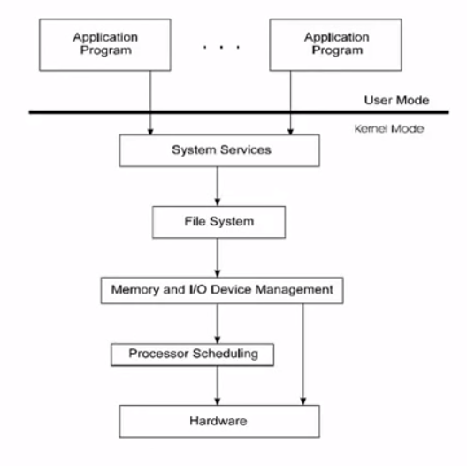
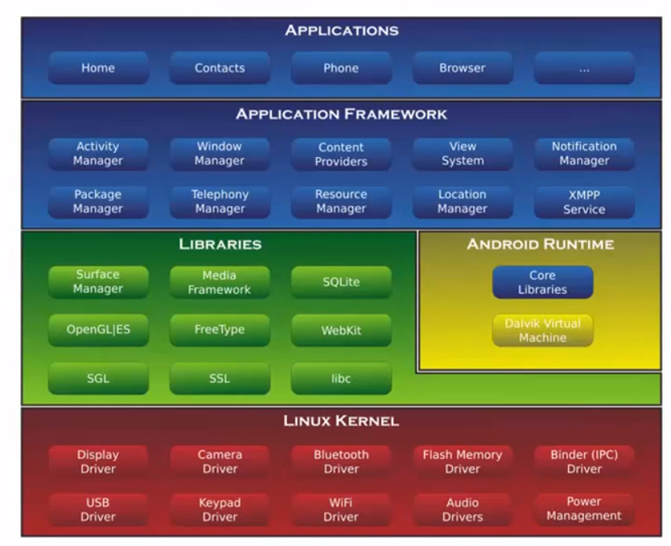
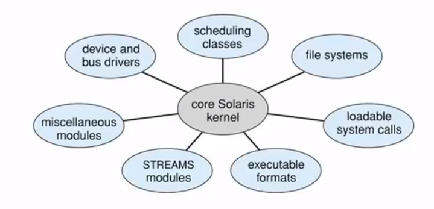

# 운영체제의 구조

## 커널 아키텍처에 따른 운영체제 분류
> 커널이 어떤 서비스까지 포함하느냐에 따른 구분

* 모놀리식 커널(Monolithic Kernel)
    * 운영체제의 모든 서비스(프로세스 관리, 메모리 관리, 파일 데이터 저장, 등등)을 하나의 커널에 구현하는 방식
    * DOS, Linux, UNIX 등
* 마이크로 커널(Micro Kernel)
    * 운영체제의 핵심 부분만 커널로 구현
        * 프로세스 관리, 가상메모리, 기본 프로세스 통신(IPC) 만을 커널로 만듦
        * 나머지는 나머지는 시스템프로그램, 응용프로그램으로 구현함
    * Mach OS, QNX, Windows NT 등
    * 커널의 규모가 작아짐
* 두가지로 나뉜 이유
    * 물론 장단점이 있기 때문
    * 마이크로 커널
        * Pros
            * 커널의 규모가 작기에 기능 확장하기 쉬움
            * 같은 이유로 새로운 하드웨어로 이식(Porting)이 쉬움
            * 코드가 짧기 때문에 신뢰성이 높다
            * 보안성이 높다
        * Cons
            * 커널 공간을 보호하기 위해 응용 프로그램 동작환경을 다른 환경에서 구성하고있음
            * 즉 사용자 공간과 커널 공간 사이의 빈번한 전환으로 성능 저하
    * 모놀리식 커널
        * Pros
            * 커널 권한과 사용자 권한의 전환이 덜하기 때문에 성능이 좋음
        * Cons
            * 코드가 길기에 디버깅, 테스팅, 검증이 비교적 어렵다
            * 새로운 하드웨어에 이식이 어렵다
            * 배포에 불편하다

## 커널을 설계하고 구성하는 방법
> 운영체제의 각 기능 요소들을 별도의 소프트웨어, 프로그램이라 전제하고 그들 사이에서 주고 받을 데이터 관계 등에 따라 설계하는 방법 -> **모듈화된 설계**

### 계층 구조 운영체제 (Layer)
* 계층 구조 운영체제
    * 모듈화 설계의 한가지 방법
    * 하위 계층의 서비스와 함수만 사용
* Pros
    * 더 명시적이고 구체적으로 만들어진다
    * 구현과 디버깅이 간단하다
* Cons
    * 계층 간의 관계 정의가 복잡하다
    * 계창 간의 시스템 호출 오버헤드로 효율 저하

  
**계층 구조 운영체제**  

  
**안드로이드의 계층 구조**  

### 모듈 구조 운영체제 (Module)
* 모듈화된 커널
    * 프로그램을 한 덩어리가 아닌 각각 모듈화 시켜서 설계, 구현 및 디버깅함
    * 기능적인 모듈화는 설계/구현/디버깅 효율을 증가시킴
    * 객체지향 프로그래밍 기법으로 구현
    * 커널은 핵심적인 구성요소만 포함
    * 다양한 동적 적재 모듈을 통해 부가적인 서비스를 제공
    * **임의의 모듈의 서비스를 호출하는것이 가능함(계층적 구조와의 차이)**

  
