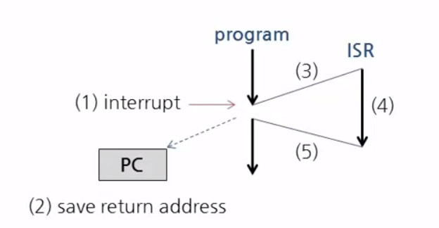
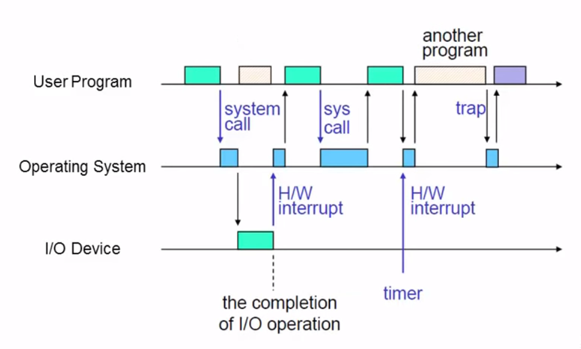
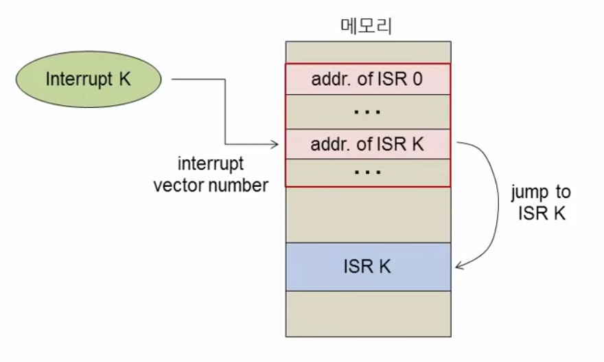

# 운영체제의 기본 동작

## 운영체제 부팅
> 일반적으로 프로그램을 실행하면, 커널에 의해서 동작함. 하지만 부팅이 되고 커널이 켜지있지 않은 상태에서 어떻게 커널을 올릴것인가? 궁금증을 해소하기 위해 부팅 과정을 배워보자
* 부팅이라는건 운영체제의 핵심 부분인 커널이라는 소프트웨어가 켜지기까지의 과정을 말하는 것
* 초기에는 ROM에 OS를 넣기도 했음
* 하지만 요즘 OS들은 크기가 매우 크기때문에 ROM에 올려 쓰기에는 무리가 있다
* 그리고 OS는 업데이트 등의 이유로 계속 변경될 가능성이 크기 때문에 ROM에 넣기엔 활용도가 떨어진다
* 그래서 나온게 바로 **부트스트랩 프로그램(Bootstrap Program) : 커널을 실행하기 위한 작은 프로그램**
    * 컴퓨터에 전원이 인가된 이후 처음 실행되는 프로그램
    * 펌웨어라는 이름으로 ROM(EEPROM, Flash Memory)에 저장된다
    * 시스템을 초기화하고 디스크에서 OS커널을 읽어와서 실행한다
* 일반적인 운영체제 부팅 과정
    * **BIOS -> 부트스트랩 코드(MBR, PBR) -> 부트 로더(grub, bootcamp) -> 커널 -> 시스템 소프트웨어**
        * 컴퓨터의 CPU는 맹목적인 기계장치이다. 전원이 들어오면 무조건 메모리에서 값을 읽어와서 실행하게 된다. 원하는 프로그램을 실행시킬려면 메모리에 프로그램을 할당해야한다.
        * 전원이 들어오면 CPU는 BIOS 프로그램이 들어있는 ROM을 읽는다.
        * 여기서 BIOS가 바로 부트스트랩 역할을 해서 커널을 올리면 되지않을까? 싶지만 최근 운영체제 커널들은 하드디스크 상에 복잡한 방식으로 위치하고 있어서 BIOS만으로 위치를 알아내고 다양한 방식으로 커널을 올리기에는 힘듦
        * 그래서 다시 한번 BIOS는 커널을 올리기 위한 복잡한 프로그램을 실행한다. 그게 바로 부트스트랩코드(MBR, PBR) 이다.
        * 부트스트랩코드가 동작하면서 복잡한 기능을 하는 부트로더(grup, bootcamp)를 실행하게 된다.
        * 최종적으로 부트로더가 커널을 올리고 부팅이 된다.

## 부트 섹터(boot sector)
* 섹터는 하드디스크의 저장단위를 말함
* 하드디스크, 메모리 등 컴퓨터시스템 데이터 저장의 기본 단위는 byte다
* 하지만 항상 byte단위로 처리하면 성능이 떨어진다.
* 그러므로 byte들의 묶음 단위로 처리하게되는데, 그 묶음의 단위가 하드디스크에선 섹터이다.
* 그중에서 하드디스크에 고정된 맨 첫번째 섹터를 부트 섹터(boot sector)라고 얘기하고, 그곳에 첫번째 부트스트랩 프로그램을 저장한다.
* 첫번째 섹터에 넣는 이유는 BIOS가 하드디스크를 검색하지 않더라도 쉽게 접근할수 있는 위치기 때문이다.

## 인터럽트(interrupt)
> 컴퓨터는 일반적으로 사람이나 외부 입출력 장치에 의해 데이터값을 입력 받고, 그 값의 변경에 따라 반응을 하게 만든 장치이다 
> 하지만 그 값의 변경은 언제 일어날지 모르는 외부작업을 기다리는 프로세스를 무한정 진행하면 이 일 때문에 다른 작업에 지장이 가게 된다.
> 그렇다면 어떠한 방법으로 처리를 해야할까? **인터럽트**를 알아보겠다.
* 운영체제의 핵심 동작 원리
* 컴퓨터에서 소프트웨어가 동작하는것에 있어 매우 매우 중요한 개념
* 일반적으로 interrupt는 흘러가고 있는 실행에 있어 방해를 일으킨다는 뜻
* 컴퓨터 시스템에서 인터럽트는 언제 발생할지 모르는 새로운 이벤트에 대해 CPU에게 **비동기적**으로 알리는 수단
    * 동기적 : 두 개체가 있고 두 개체가 서로 데이터를 주고 받을 때, 서로 주고 받는 시간을 알고 있음
    * 비동기적 : 두 개체가 있고 두 개체가 서로 데이터를 주고 받을 때, 서로 주고 받는 시간을 모름
* 인터럽트가 들어오기 전까지 CPU는 새로운 EVENT를 생각하지 않고 일을 처리한다. 그러다 인터럽트가 발생하면 정해진 서비스를 수행한다.
    * 인터럽트 서비스가 완료되면 중단된 위치에서 수행을 재개한다.

## 운영체제와 인터럽트
> 복잡한 외부환경에 대해 컴퓨터가 잘 동작하는것은 그 밑바닥에 인터럽트의 개념이 있기 때문이다.
* **운영체제의 모든 동작은 인터럽트에 의해 시작된다!**
    * no interrupt, no work
* 인터럽트의 종류
    * 하드웨어 인터럽트
        * 입출력 장치에 의해 발생함 (I/O 처리, 타이머 처리)
    * 소프트웨어 인터럽트
        * 프로그램에 의한 운영체제 서비스 요청 (특별한 CPU 명령어)
    * 내부 인터럽트 (trap, exception)
        * 운영체제 커널레벨에서 발생하는 인터럽트이다. 소프트, 하드의 중간 쯤?
        * 프로그램 에러에 의해 발생 (0으로 나누기, 잘못된 메모리 주소)

## 인터럽트 처리 과정
> 실제 구체적인 내용을 이해하기 위해서는 컴퓨터 시스템이 소프트웨어를 실행시키는 LOW-LEVEL의 동작방식과 운영체제가 프로그램을 실행시킬 때 필요한 주변 자료구조를 이해해야지 인터럽트 처리과정을 보다 정확하게 알 수 있다.
1. CPU에서 실행되는 작업 중지
    * 현재 CPU 상태 저장(중단된 명령어의 주소 등)
2. CPU 실행 제어를 인터럽트 서비스 루틴(ISR)로 이동한다.
    * 인터럽트 벡터(interrupt vector)로부터 ISR위치 식별
3. 중단된 작업을 다시 실행
    * 저장된 주소로 CPU 실행 제어 이동

##### 그림을 보고 좀더 자세히 알아보겠다

1. 프로그램이 실행되다 어느 순간 비동기적으로 `(1) interrupt`가 발생한다.
2. 현재 실행되는 프로그램을 중지시키는 일이 발생한다. 그리고 중단된 명령어의 주소를 기억해둔다 `(2)save return address`
3. `(3)인터럽트를 처리하기 위한 프로그램`을 실행한다
4. `(4)인터럽트 된 프로그램을 실행`한다
5. `(5)원래 저장된 위치로 돌아와서 다시 프로그램을 실행`한다
* 이렇게 인터럽트를 처리하러 갔다가 다시 돌아오는 작업을 반복하는 이유는 CPU는 한번에 하나의 프로그램만 실행할 수 있기 때문이다.
* 인터럽트를 처리하기 위해서도 어떠한 프로그램이 실행되어야한다. CPU가 하는 모든 작업은 코드가 있어야 가능하기 때문
* 현재 프로그램이 실행되는 시점((1)이전)에 그 인터럽트를 처리할 코드가 있을 수 없기 때문
* 그래서 인터럽트 처리 프로그램을 별도로 두고 인터럽트가 발생시 인터럽트를 해당 프로그램에서 처리하고 실행이 끝나면 원래대로 돌아온다.

실제 컴퓨터 시스템에서 운영체제와 사용자 프로그램이 작동될 때 앞에서 얘기한 3가지 인터럽트(HW, SW, INNER 인터럽트)과정을 보여주는 그림이다.

## 인터럽트 벡터(interrupt vector)
> 인터럽트가 비동기적으로 발생하기 때문에 ISR은 일반적으로 운영체제 내에서 특정한 인터럽트가 발생하면 처리할 방법을 넣어둔다. 하지만 인터럽트가 한두가지가 아니기 때문에 각각의 코드를 특정 인터럽트에 맞게 실행할 수 있도록 인터럽트 벡터를 설정한다.
* 인터럽트 벡터 : 인터럽트 서비스 루틴(ISR)의 주소를 저장한 테이블
    * 운영체제가 관리하는 메모리 자료구조
    * 인터럽트 종류에 따라 테이블 인덱스가 저장된다.

* 각종 인터럽트 처리 코드의 주소가 메모리에 빨간 박스와 같이 적재되어 있다. 이게 바로 인터럽트 벡터(처리 코드의 주소가 있음)
* 예를들어 interrupt K 가 발생하면 컴퓨터는 인터럽트 번호로 식별한다(ex. 키보드 입력은 0번, timer가 작동하면 1번)
* 인터럽트 벡터로 찾아가서 그 번호를 가지고 인덱스로 접근하여 interrupt service routine K에 해당하는 주소를 찾는다.
* ISR K의 주소로 찾아가서 인터럽트 처리 코드를 실행한다.

## 운영체제의 이중 모드 동작(dual mode operation)
> 컴퓨터에서 어떤 코드가 실행될때는 CPU에서 실행되는 유일한 코드이므로 컴퓨터의 자원을 모두 사용할 수 있을것이라 오해한다.  
> 그러나 이런식으로 CPU자원을 실행되는 프로그램에게 다 할당하면, 운영체제의 핵심 임무를 수행할 수 없게 된다. (많은 프로그램을 동시에 사용하며 자원을 균등하게 배분, 프로그램과 프로그램 사이에 오류나 충돌이 발생하지 않게 제어함 그외 등등의 임무들)  
* 현대의 컴퓨터 시스템에서는 프로그램 코드가 CPU에서 실행된다 할지라도, 실행되는 환경에 따라 자원 사용을 제한시킨다.
* 그것이 바로 운영체제의 이중 모드 동작이다.
* 운영체제 이중 모드 동작은 CPU와 함께 협력하여 이루어진다. (사용자모드, 커널모드 구분)
* 운영체제는 모드 구분을 위한 정보를 세팅해준다.
* Privileged Instruction은 커널 모드에서만 실행된다.
* CPU가 모드를 인식하기 위해서는 하드웨어의 **모드 비트(mode bit)** 가 필요하다.
    * 사용자 모드는 1, 커널모드는 0
* 사용자 프로그램에서 커널모드가 필요할때는 운영체제 서비스를 요청하는 시스템호출(system call)을 통해 일시적으로 커널모드로 전환하고, 종료 후에는 다시 사용자 모드로 전환된다.

* 그림과 같이 사용자모드에서 예를 들어 파일을 읽고 싶다면 커널에게 system call을 하게된다.
* 커널이 요청을 받아 모드를 0으로 바꾸고, 시스템 자원을 엑세스하는 작업을 진행 후 모드 비트를 다시 1로 바꿔서 넘겨주는 작업을 한다.
* **마이크로 커널로 구현을 하면 사용자모드와 커널모드의 전환이 빈번하게 일어나서 성능이 떨어진다.**
