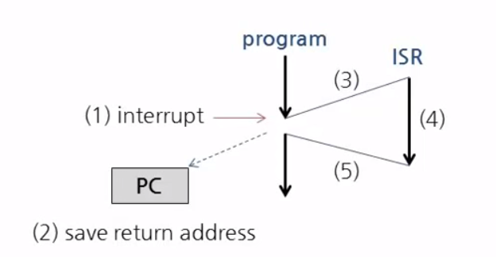
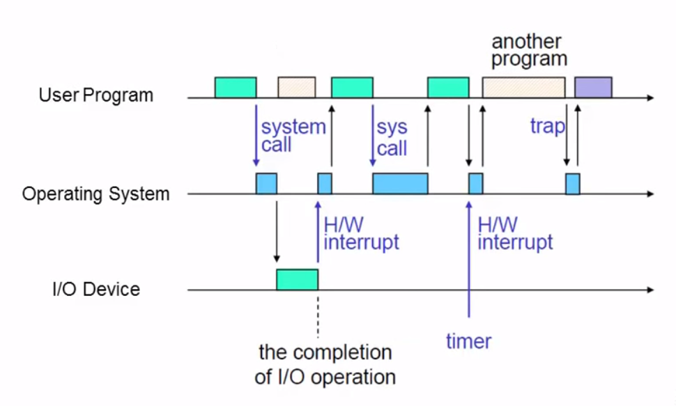
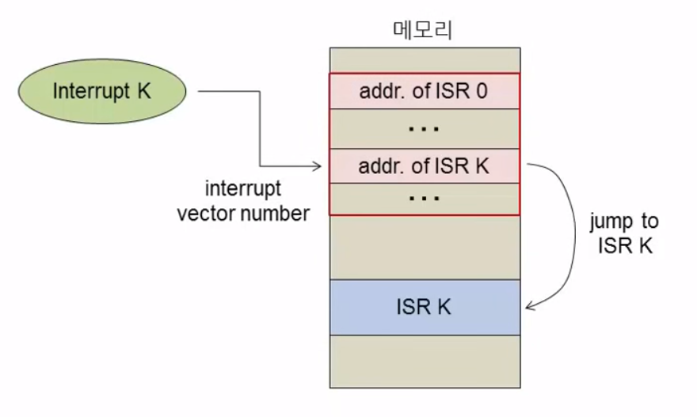
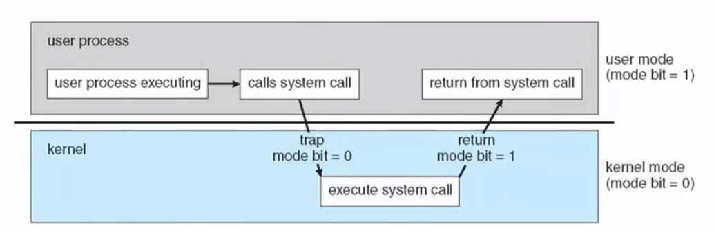

# 운영체제의 기본 동작

## 운영체제 부팅
> 일반적으로 프로그램을 실행하면, 커널에 의해서 동작함. 하지만 부팅이 되고 커널이 켜지있지 않은 상태에서 어떻게 커널을 올릴것인가? 궁금증을 해소하기 위해 부팅 과정을 배워보자
* 부팅이라는건 운영체제의 핵심 부분인 커널이라는 소프트웨어가 켜지기까지의 과정을 말하는 것
* 초기에는 ROM에 OS를 넣기도 했음
* 하지만 요즘 OS들은 크기가 매우 크기때문에 ROM에 올려 쓰기에는 무리가 있다
* 그리고 OS는 업데이트 등의 이유로 계속 변경될 가능성이 크기 때문에 ROM에 넣기엔 활용도가 떨어진다
* 그래서 나온게 바로 **부트스트랩 프로그램(Bootstrap Program) : 커널을 실행하기 위한 작은 프로그램**
    * 컴퓨터에 전원이 인가된 이후 처음 실행되는 프로그램
    * 펌웨어라는 이름으로 ROM(EEPROM, Flash Memory)에 저장된다
    * 시스템을 초기화하고 디스크에서 OS커널을 읽어와서 실행한다
* 일반적인 운영체제 부팅 과정
    * **BIOS -> 부트스트랩 코드(MBR, PBR) -> 부트 로더(grub, bootcamp) -> 커널 -> 시스템 소프트웨어**
        * 컴퓨터의 CPU는 맹목적인 기계장치이다. 전원이 들어오면 무조건 메모리에서 값을 읽어와서 실행하게 된다. 원하는 프로그램을 실행시킬려면 메모리에 프로그램을 할당해야한다.
        * 전원이 들어오면 CPU는 BIOS 프로그램이 들어있는 ROM을 읽는다.
        * 여기서 BIOS가 바로 부트스트랩 역할을 해서 커널을 올리면 되지않을까? 싶지만 최근 운영체제 커널들은 하드디스크 상에 복잡한 방식으로 위치하고 있어서 BIOS만으로 위치를 알아내고 다양한 방식으로 커널을 올리기에는 힘듦
        * 그래서 다시 한번 BIOS는 커널을 올리기 위한 복잡한 프로그램을 실행한다. 그게 바로 부트스트랩코드(MBR, PBR) 이다.
        * 부트스트랩코드가 동작하면서 복잡한 기능을 하는 부트로더(grup, bootcamp)를 실행하게 된다.
        * 최종적으로 부트로더가 커널을 올리고 부팅이 된다.

## 부트 섹터(boot sector)
* 섹터는 하드디스크의 저장단위를 말함
* 하드디스크, 메모리 등 컴퓨터시스템 데이터 저장의 기본 단위는 byte다
* 하지만 항상 byte단위로 처리하면 성능이 떨어진다.
* 그러므로 byte들의 묶음 단위로 처리하게되는데, 그 묶음의 단위가 하드디스크에선 섹터이다.
* 그중에서 하드디스크에 고정된 맨 첫번째 섹터를 부트 섹터(boot sector)라고 얘기하고, 그곳에 첫번째 부트스트랩 프로그램을 저장한다.
* 첫번째 섹터에 넣는 이유는 BIOS가 하드디스크를 검색하지 않더라도 쉽게 접근할수 있는 위치기 때문이다.

## 인터럽트(interrupt)
> 컴퓨터는 일반적으로 사람이나 외부 입출력 장치에 의해 데이터값을 입력 받고, 그 값의 변경에 따라 반응을 하게 만든 장치이다 
> 하지만 그 값의 변경은 언제 일어날지 모르는 외부작업을 기다리는 프로세스를 무한정 진행하면 이 일 때문에 다른 작업에 지장이 가게 된다.
> 그렇다면 어떠한 방법으로 처리를 해야할까? **인터럽트**를 알아보겠다.
* 운영체제의 핵심 동작 원리
* 컴퓨터에서 소프트웨어가 동작하는것에 있어 매우 매우 중요한 개념
* 일반적으로 interrupt는 흘러가고 있는 실행에 있어 방해를 일으킨다는 뜻
* 컴퓨터 시스템에서 인터럽트는 언제 발생할지 모르는 새로운 이벤트에 대해 CPU에게 **비동기적**으로 알리는 수단
    * 동기적 : 두 개체가 있고 두 개체가 서로 데이터를 주고 받을 때, 서로 주고 받는 시간을 알고 있음
    * 비동기적 : 두 개체가 있고 두 개체가 서로 데이터를 주고 받을 때, 서로 주고 받는 시간을 모름
* 인터럽트가 들어오기 전까지 CPU는 새로운 EVENT를 생각하지 않고 일을 처리한다. 그러다 인터럽트가 발생하면 정해진 서비스를 수행한다.
    * 인터럽트 서비스가 완료되면 중단된 위치에서 수행을 재개한다.

## 운영체제와 인터럽트
> 복잡한 외부환경에 대해 컴퓨터가 잘 동작하는것은 그 밑바닥에 인터럽트의 개념이 있기 때문이다.
* **운영체제의 모든 동작은 인터럽트에 의해 시작된다!**
    * no interrupt, no work
* 인터럽트의 종류
    * 하드웨어 인터럽트
        * 입출력 장치에 의해 발생함 (I/O 처리, 타이머 처리)
    * 소프트웨어 인터럽트
        * 프로그램에 의한 운영체제 서비스 요청 (특별한 CPU 명령어)
    * 내부 인터럽트 (trap, exception)
        * 운영체제 커널레벨에서 발생하는 인터럽트이다. 소프트, 하드의 중간 쯤?
        * 프로그램 에러에 의해 발생 (0으로 나누기, 잘못된 메모리 주소)

## 인터럽트 처리 과정
> 실제 구체적인 내용을 이해하기 위해서는 컴퓨터 시스템이 소프트웨어를 실행시키는 LOW-LEVEL의 동작방식과 운영체제가 프로그램을 실행시킬 때 필요한 주변 자료구조를 이해해야지 인터럽트 처리과정을 보다 정확하게 알 수 있다.
1. CPU에서 실행되는 작업 중지
    * 현재 CPU 상태 저장(중단된 명령어의 주소 등)
2. CPU 실행 제어를 인터럽트 서비스 루틴(ISR)로 이동한다.
    * 인터럽트 벡터(interrupt vector)로부터 ISR위치 식별
3. 중단된 작업을 다시 실행
    * 저장된 주소로 CPU 실행 제어 이동

##### 그림을 보고 좀더 자세히 알아보겠다

1. 프로그램이 실행되다 어느 순간 비동기적으로 (1) interrupt가 발생한다.
2. 현재 실행되는 프로그램을 중지시키는 일이 발생한다. 그리고 중단된 명령어의 주소를 기억해둔다 (2)save return address
3. (3)인터럽트를 처리하기 위한 프로그램을 실행한다
4. (4)인터럽트 된 프로그램을 실행한다
5. (5)원래 저장된 위치로 돌아와서 다시 프로그램을 실행한다
* 이렇게 인터럽트를 처리하러 갔다가 다시 돌아오는 작업을 반복하는 이유는 CPU는 한번에 하나의 프로그램만 실행할 수 있기 때문이다.
* 인터럽트를 처리하기 위해서도 어떠한 프로그램이 실행되어야한다. CPU가 하는 모든 작업은 코드가 있어야 가능하기 때문
* 현재 프로그램이 실행되는 시점((1)이전)에 그 인터럽트를 처리할 코드가 있을 수 없기 때문
* 그래서 인터럽트 처리 프로그램을 별도로 두고 인터럽트가 발생시 인터럽트를 해당 프로그램에서 처리하고 실행이 끝나면 원래대로 돌아온다.

실제 컴퓨터 시스템에서 운영체제와 사용자 프로그램이 작동될 때 앞에서 얘기한 3가지 인터럽트(HW, SW, INNER 인터럽트)과정을 보여주는 그림이다.

## 인터럽트 벡터(interrupt vector)
> 인터럽트가 비동기적으로 발생하기 때문에 ISR은 일반적으로 운영체제 내에서 특정한 인터럽트가 발생하면 처리할 방법을 넣어둔다. 하지만 인터럽트가 한두가지가 아니기 때문에 각각의 코드를 특정 인터럽트에 맞게 실행할 수 있도록 인터럽트 벡터를 설정한다.
* 인터럽트 벡터 : 인터럽트 서비스 루틴(ISR)의 주소를 저장한 테이블
    * 운영체제가 과닐하는 메모리 자료구조
    * 인터럽트 종류에 따라 테이블 인덱스가 저장된다.

* 각종 인터럽트 처리 코드의 주소가 메모리에 빨간 박스와 같이 적재되어 있다. 이게 바로 인터럽트 벡터(처리 코드의 주소가 있음)
* 예를들어 interrupt K 가 발생하면 컴퓨터는 인터럽트 번호로 식별한다(ex. 키보드 입력은 0번, timer가 작동하면 1번)
* 인터럽트 벡터로 찾아가서 그 번호를 가지고 인덱스로 접근하여 interrupt service routine K에 해당하는 주소를 찾는다.
* ISR K의 주소로 찾아가서 인터럽트 처리 코드를 실행한다.

## 운영체제의 이중 모드 동작(dual mode operation)
> 컴퓨터에서 어떤 코드가 실행될때는 CPU에서 실행되는 유일한 코드이므로 컴퓨터의 자원을 모두 사용할 수 있을것이라 오해한다.  
> 그러나 이런식으로 CPU자원을 실행되는 프로그램에게 다 할당하면, 운영체제의 핵심 임무를 수행할 수 없게 된다. (많은 프로그램을 동시에 사용하며 자원을 균등하게 배분, 프로그램과 프로그램 사이에 오류나 충돌이 발생하지 않게 제어함 그외 등등의 임무들)  
* 현대의 컴퓨터 시스템에서는 프로그램 코드가 CPU에서 실행된다 할지라도, 실행되는 환경에 따라 자원 사용을 제한시킨다.
* 그것이 바로 운영체제의 이중 모드 동작이다.
* 운영체제 이중 모드 동작은 CPU와 함께 협력하여 이루어진다. (사용자모드, 커널모드 구분)
* 운영체제는 모드 구분을 위한 정보를 세팅해준다.
* Privileged Instruction은 커널 모드에서만 실행된다.
* CPU가 모드를 인식하기 위해서는 하드웨어의 **모드 비트(mode bit)**가 필요하다.
    * 사용자 모드는 1, 커널모드는 0
* 사용자 프로글매에서 커널모드가 필요할때는 운영체제 서비스를 요청하는 시스템호출(system call)을 통해 일시적으로 커널모드로 전환하고, 종료 후에는 다시 사용자 모드로 전환된다.

* 그림과 같이 사용자모드에서 예를 들어 파일을 읽고 싶다면 커널에게 system call을 하게된다.
* 커널이 요청을 받아 모드를 0으로 바꾸고, 시스템 자원을 엑세스하는 작업을 진행 후 모드 비트를 다시 1로 바꿔서 넘겨주는 작업을 한다.
* **마이크로 커널로 구현을 하면 사용자모드와 커널모드의 전환이 빈번하게 일어나서 성능이 떨어진다.**
