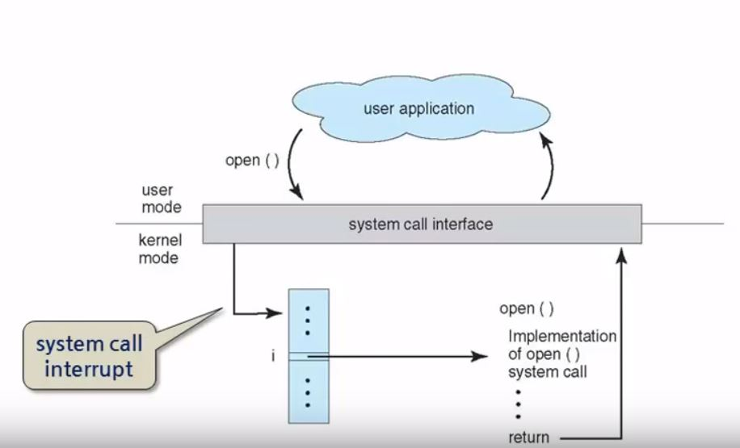

# 시스템 호출과 라이브러리
> 컴퓨터의 보호를 위해서 일반적인 사용자 프로그램은 하드웨어 자원을 직접적으로 이용하지 못한다.
  그렇다면 사용자 프로그램은 어떻게 운영체제의 자원에 접근 할 수 있을까? 몇몇 개발자들은 자기도 모르는 사이 `시스템 함수와 시스템 라이브러리`를 통해 자원에 접근하고 있을것이다.

## 시스템 호출
운영체제가 제공하는 서비스에 대한 프로그래밍 인터페이스(System 함수)
* 하드웨어의 상세한 동작을 추상화 (프로그램의 편의성)
* 운영체제를 통해서만 하드웨어의 자원에 접근 (보호)

일반적으로 C/C++ 언어로 작성되서 함수 형태로 제공된다. 

##응용프로그램 인터페이스
Application Program Interface(API)
* 시스템 호출을 일반 프로그래머들이 쉽게 사용 할 수 있게 보다 높은 수준의 함수 집합을 제공
* 커널 서비스를 사용해서 사용자에게 더 편한 접근성을 가져다 주는 커널 라이브러리
* 일반적인 API의 예시
  * win32 API, POSIX API, JAVA API
* 응용 프로그래머들이 실제로 사용하는 프로그래밍 인터페이스

## 시스템 호출(System Call) 인터페이스
시스템 호출이 사용됐을때 동작이 되는 과정을 나타내는 그림

겉으로 보면 단순한 함수 호출과 리턴으로 보이지만 실제로는 다르다. 
예를들어 user application가 커널의 `open()` 함수를 call 했다면 단순하게 커널의 `open()`함수를 실행하는것이 아니라 `system call interface`에서 특정 함수를 실행하기 위한 `system call interrupt`라는 소프트웨어 인터럽트를 운영체제에 발생시킨다.
`system call interrupt`는 인터럽트 벡터에서 해당 인터럽트를 처리하는 함수를 찾아내서 실행시키고 값을 반환한다. 
이 과정에서 `user mode(1)`와 `kernel mode(0)` 전환 또한 일어난다. 

## 라이브러리인 경우
그림의 printf()는 라이브러리 함수이다. 커널에서 실행되는것이 아니라 standard C library에서 실행된다. 여기 라이브러리에에있는 printf 코드에는 system call의 write()라는 함수를 호출하게 되어있다.  
라이브러리는 추상적인 서비스를 제공하지만 결국은 시스템콜을 사용한다는걸 알아두면 된다.

## 리눅스의 시스템 호출과 라이브러리
> 결론! 운영체제는 운영체제가 가지고 있는 다양한 기능들을 응용프로그램이나 사용자가 사용할수있도록 서비스로 제공해야하는데 그것을 이용하는 방법이 곧 함수형태로 제공되는것이고 그 함수가 바로 `system call` 인것  이 `system call`을 다양한 방식으로 고차원적으로 활용하게 도와주는것이 라이브러리

가장 안쪽에 있는것이 운영체제의 핵심적인 기능 이것이 system call interface를 통해서 제공되는것. 사용자 프로그램은 직접 system call을 호출해서 사용할 수 있고, 혹은 더 편리하게 이용하도록 라이브러리 함수를 호출해서 이용할 수 있다.

## 매개변수 전달
* 매개변수
  * 시스템 호출 시에 전달되는 정보
  * 운영체제와 호출의 종류에 따라 다르다
* 전달 방법
  * 레지스터(register)에 저장
    * **속도가 빠르다**
    * 제한된 개수와 길이의 매개변수만 허용
  * 메모리 내의 블록(block) 혹은 테이블(table)에 저장
    * 좀 더 많은 데이터양이 전달될때 사용한다.
    * **메모리 주소** 를 레지스터에 저장하여 전달
  * 스택(stack) 메모리를 이용
    * 매개변수를 전달하는 가장 일반적인 방법임. (자료구조의 스택과 상당히 유사함)
    * 프로그램이 매개변수를 넣고(push) 운영체제가 가져감(pop)
  **블록과 스택 방법은 매개변수의 개수나 길이의 제약이 없다**

## 시스템 호출의 종류 (types of system calls)
* 프로세스 제어 (process control)
* 파일 관리 (file management)
* 장치 관리 (device management)
* 정보 유지관리 (information maintenance)
* 통신 (communications)
* 보호 (protection)
