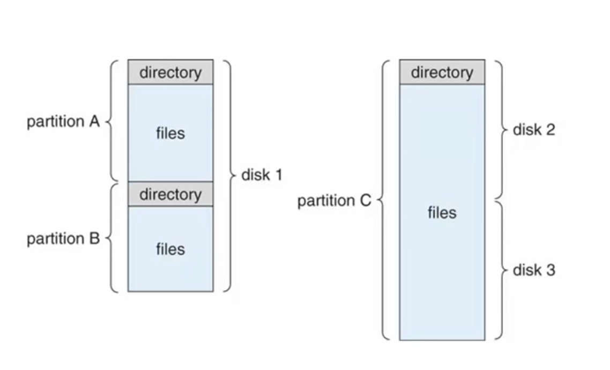
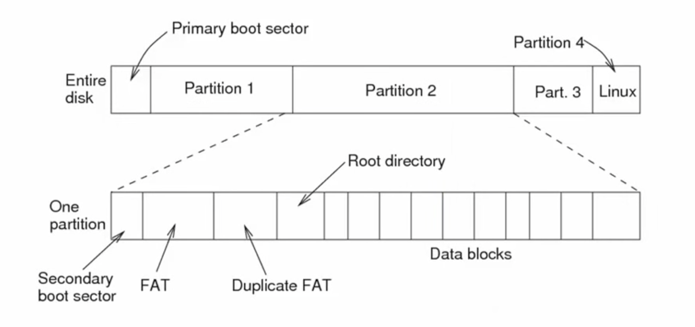
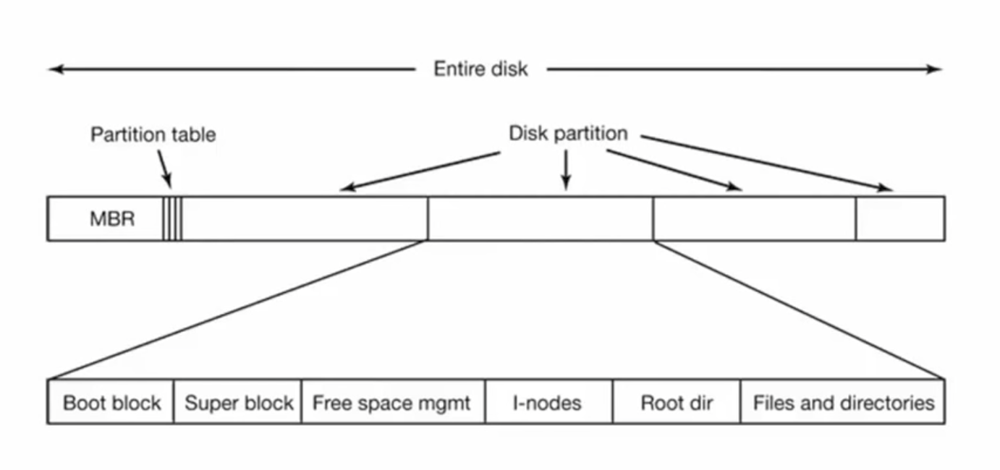
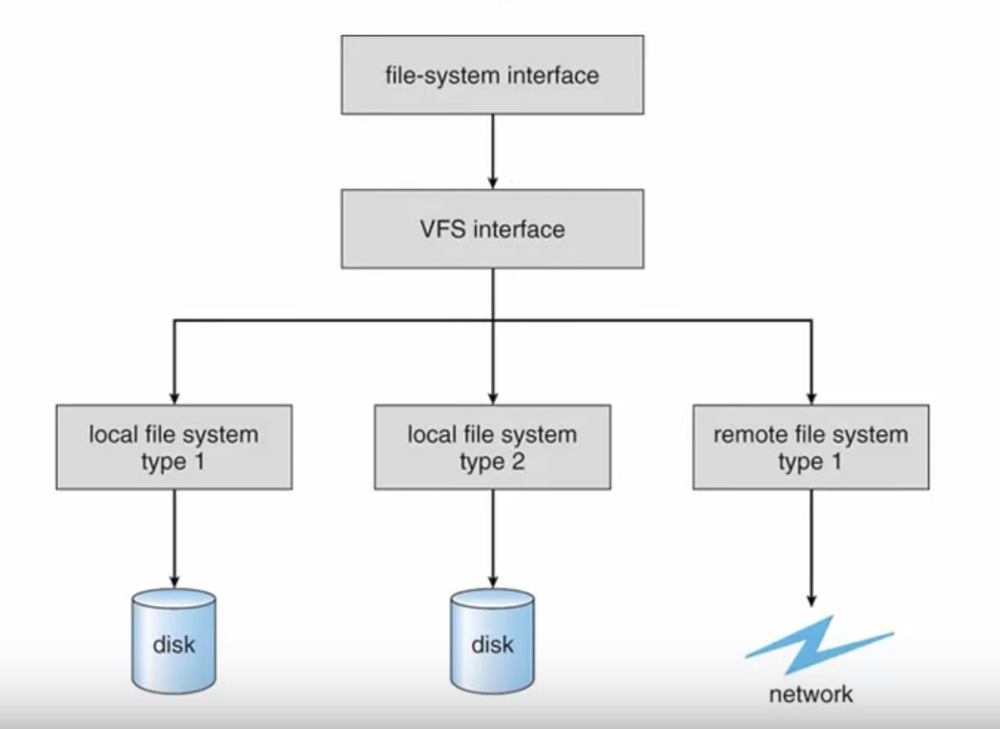

# 파일시스템 개요
> 하드디스크는 저장만을 위한 공간이다. 그곳에 여러가지 프로그램이나 데이터를 효율적으로 저장하고 편리하게 찾아서 이용하기위해선 관리하기 위한 서비스 즉 소프트웨어가 필요하다
> 그런 역할을 담당하는것이 운영체제의 파일시스템이다. 이번에는 파일시스템이 무엇인지 어떤 구조로 되어있는지, 어떤 서비스를 제공하는지 공부해볼것이다.

## 저장장치
1. 저장한 데이터를 빠르게 찾을수 있어야 하고 새로운 데이터를 효율적으로 저장할 수 있어야함.
2. 한정된 공간을 최대한 체계적으로 정리하며, 빈공간이 없도록 관리해야한다.

## 파일 개념 (File Concept)
* 저장장치의 물리적 특성을 추상화한 논리적 저장 단위
  * 컴퓨터에서 처리되는 다양한 정보를 저장
  * **연속적인 논리 주소 공간**으로 구성
  * 파일 내의 정보나 의미나 형식은 **사용자**에 의해 정의됨
* 파일의 종류
  * 프로그램
  * 데이터 : 숫자, 문자 이진(binary) 값의 연속된 배열 
  
## 파일 시스템 (File System)
* 운영체제에 포함된 파일 접근 및 관리 모듈
* 저장장치에 구성된 파일들의 저장 체계
* 파일의 온라인 접근과 저장을 위한 서비스를 제공

## 저장장치의 구조
* 파티션(partition) : 저장장치 내에서 파일시스템 하나를 구축하기 위한 하나의 **구획**을 의미함. 하나의 하드디스크에는 여러개의 파티션이 있을 수 있다. 또는 여러개의 하드디스크가 있더라도 하나의 파티션의 구획으로 묶을 수도 있다. 
  * 복잡한 관리를 위해 저장장치 공간을 세분화
  * 개별 파일 시스템의 크기 제한
  * 여러 개의 파일 시스템 사용
  * 별도의 스왑 혹은 포맷되지 않은 공간으로 활용
* 볼륨(volume)
  * 파일 시스템을 포함하는 개체
    * 논리적인 가상 디스크 (virtual disk)
    * 저장장치의 일부, 저장장치의 전체, 여러개의 저장장치 묶음 등으로 구성
  > 구획의 의미로 보면 볼륨과 파티션은 비슷하다. 큰 차이점은 파티션은 하드디스크에서의 구획 자체를 의미하고 볼륨은 그 구획에 파일시스템에 실제로 구축되어있는 상황을 볼륨이라고 한다.
  > 파일탐색기에서 보이는 C,D 드라이브를 볼륨이라고 부른다.

## 전형적인 파일시스템의 구조

이 그림은 파티션 혹은 볼륨과 디스크와의 관계를 보여준다. 

왼쪽처럼 하나의 디스크 안에 여러개의 파티션이 있을 수 있다. 각 파티션엔 각자의 파일시스템이 들어가고있다. 
오른쪽 처럼 여러개의 디스크를 묶어서 하나의 파티션으로 만들 수 있다.

> 위 그림처럼 파티션에 파일 시스템이 들어가 있다면 볼륨으로 분류 할 수 있다.

## FAT 파일 시스템 구조

파일 시스템의 구조는 운영체제마다 각각 다른 방식으로 저장장치를 관리할 수 있기 때문에 다를수있다. 엄밀히 말하자면 운영체제마다 다르기보단 **파일시스템의 관리정책**에 따라 다르게된다. 
그래서 보통 파일시스템은 그 이름을 각각 가지고있다. 위에서 보이는건 `FAT`이라는 Windows에서 사용하고있는, 일반적인 컴퓨터시스템에서 기초적인 파일시스템 구조이다.
 
파일시스템 종류마다 구조가 달라진다고 했지만, 근본적인 원리는 거의 대동소이하다. 그래서 가장 간단하다 할수있는 FAT을 알아보겠다. 

* 위의 박스는 하나의 하드디스크이다. 
  * 총 4개의 파티션으로 나뉘어져있다. 
  * 각각의 파티션은 서로 다른 파일시스템 혹은 저장방식으로 운용할 수 있다. 
  * 맨 앞에있는것이 부트스트랩 코드가 들어가는 `MBR(Master Boot Record)`, `PBR(Primary Boot Record)`를 가르킨다.
* 아래의 박스는 파티션2번의 세부 구조`FAT`를 보여준다. `FAT`이라는 파일시스템은 크게 3가지로 구성되어있다.
  * `FAT : File Allocation Table` 파일이 할당되어있는 정보를 담고 있는 테이블
    * 파일들이 어디에 저장되어있는지, **위치정보**를 함축되어있는 테이블로 미리 가지고 있게 된다. 
  * `Root Directory` : 디렉토리를 찾아가는 맨 처음 위치
  * `Data blocks` : 파일이 **실제 저장되는 위치**
> `Data block` 에 들어있는 실제 파일이 어디에 있냐는 `FAT`정보와 그것을 찾아가는 첫번째 위치인 `Root Directory` 를 알고있다면 그 어디에 있는 파일이던지 트리구조를 통해서 손쉽게 접근이 가능하게되는 시스템

## 파일시스템 구조의 다른 예

리눅스 파일시스템의 예. 
`FAT`과 근본적인 동작방식은 비슷하다.
> 다양한 파일시스템 덕분에 파일을 좀 더 빨리 찾고, 생성하고, 낭비없이 사용할 수 있게된다.

## 파일 속성 (File Attributes)
파일이 위치하는 디렉토리 내에 속성 정보로 있다.
* 파일의 특성을 설명하기 위한 부가 정보
  * 디렉터리 구조 내에 저장
* 파일 속성
  * Name: 파일 이름으로 사람이 읽을 수 있는 유일한 파일 정보
  * Identifier: 파일 시스템에서 파일을 식별하는 고유한 식별자. (숫자로 된 태그)
  * Type: 서로 다른 파일 종류를 지원하기 위한 정보
  * Location: 저장장치 내에서 파일의 위치를 가리키는 포인터
  * Size: 파일의 현재 크기
  * Protection: 파일에 대한 접근 제어 정보 (읽기 쓰기 실행)
  * Time, Date and User Identification: 보호, 보안, 사용 감시에 활용
  
## 파일시스템 마운팅 (Mounting)
> 컴퓨터 시스템에서 운영체제가 하드디스크에 구축되어있는 파일시스템을 사용 할 수 있도록 해주는 과정
* 디스크 혹은 볼륨이 파일 시스템을 현재 운영체제에서 사용 할 수 있다록 연결
  * 연결할 파일 시스템이 들어 있는 장치 번호, 연결될 위치 (mount point), 파일 시스템의 종류 등을 인자로 지정
    * ex) `mount /dev/sda2 -t ext3 /mnt`
  * 운영체제가 파일 시스템의 유효성을 검사하고 기존 디렉토리 구조에 연결하여 표시한다.
  
## 가상 파일 시스템 (Virtual File System, VFS)
일반적으로 Windows같은 경우는 한 종류의 파일시스템으로 운용한다. 
그런데 Linux는 **다양한 파일시스템**이 하나의 운영체제 안에 존재한다. 
한 컴퓨터 안에 여러개의 파일시스템이 있으면 그 운영체제의 파일시스템 모듈은 어떻게 구성되어야 하냐면, **각각의 파일시스템을 위한 별도의 인터페이스를 만들어 System Call로 제공**해야한다. 
<br/?>
이러한 불편함을 덜기 위해 Linux 파일시스템에서는 각기 다른 파일시스템이라도 실제 운영체제가 제공하는 서비스 `VFS Interface`라는 가상의 파일시스템으로 제공하도록 구축하고 있다. 
이렇게 하게되면 각각의 파일시스템은 `VFS`가 요구하는대로 자기네들의 서비스를 제공하면되고, `VFS`는 단일화된 System call로 사용자에게 제공해주게 된다.  
**이 덕분에 객체지향적으로 설계할 수 있고, 사용자는 VFS의 인터페이스만 숙지하면 된다는 이점**이 있다.

> 서로 다른 파일 시스템을 하나의 운영체제에서 사용할 수 있게 도와주는 VFS

* 각 파일 시스템을 위한 별도의 디렉토리 및 파일 루틴을 작성하고 인터페이스를 제공
  * 파일 시스템 모듈이 복잡해진다.
* 객체지향적 접근 방법
  * 기본 시스템 호출을 실제 파일 시스템 구현으로부터 분리
  * VFS에 대한 API를 프로그래머에게 제공
  * VFS는 실제 파일 시스템을 위한 객체와 연산의 집합을 정의
    * 각 파일 시스템 객체는 함수의 테이블을 VFS에 제공
