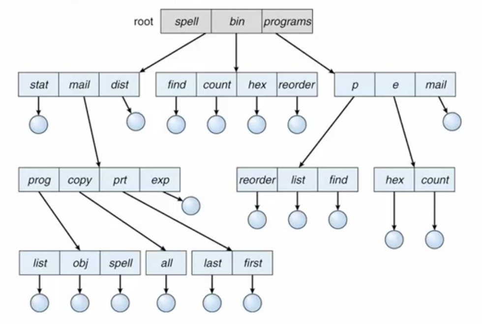
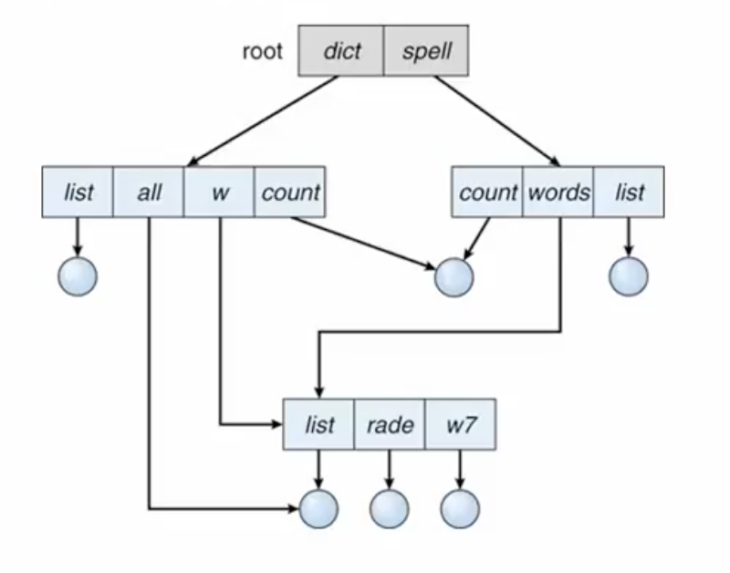

# 디렉토리
> 디렉토리 : 여러개의 파일들을 효율적으로 접근하기 위한 관리 기법의 가장 근본적인 수단

## 디렉토리 구조
일반적으로 디렉토리라고 하면 트리구조로 구성된 파일의 저장체계를 말한다. 현재 대부분의 운영체제는 이런 트리구조로 파일시스템을 구성하고 있다.  
원래 디렉토리 개념은 트리구조를 말하기 보다는 여러개의 파일을 저장하기 위한 체계적인 구성 방법이다. 
디렉토리의 사전적 의미는 전화번호부 안내책자 등이다. 즉 내가 찾고자 하는 정보가 있을때 전체를 다 뒤져보기보다는 인덱스 키값으로 보다 손쉽게 정보를 찾을 수 있는 방식으로 되어있는걸 디렉토리라한다. 
 
파일시스템에도 이와 마찬가지로 저장장치에 있는 많은 파일에 대해서 내가 어떤 특정한 파일을 찾아서 저장된 데이터를 읽고자할때, 파일 시스템 저장장치를 모두 뒤져서 파일을 찾는것은 시간이 많이 걸리는 작업이다. 
그래서 저장되어있는 위치 같은 부가정보를 별도로 어딘가 저장해두면 파일시스템 전체를 안뒤지더라도 **부가정보만 가지고 파일 위치를 손쉽게 찾게된다.** 이런 방식을 바로 디렉토리라고 말한다. 
 
파일에 대한 위치와 같은 부가정보도 디스크에 저장되어있어야한다 원칙적으로 디렉토리라는것도 하나의 파일로써 저장장치 안에 보관된다.  
그 내용은 일반적인 파일처럼 사용자가 쓸수있는게 아니고 파일을 가르키는 부가정보만 담는 특수한 파일이라고 볼수있다
 
 

## 트리 구조 (tree-structured) 디렉토리
이렇게 디렉토리를 이용한다고해도 시스템내 파일이 무지막지하게 많아지면 하나의 디렉토리로 수십만개의 파일을 찾기 어렵다 
그래서 실제 운영체제에서는 관련있는 파일끼리 모아서 관련있는 정보만 담고있는 디렉토리를 여러개를 구성하고, 구성된 디렉토리 끼리도 위치정보를 가지고있는 부가정보를 저장함으로써 많은 수의 파일을 효율적으로 찾을수 있게 했다.
혼선을 줄이기위해 각각의 디렉토리는 계층구조로써 트리의 구조를 가지도록 하고 있다. 
 
트리 구조 및 key값을 가지고 있기에 log 복잡도 정도로 데이터를 찾을 수 있다. 

* 다단계 트리 구조
  * 각 사용자가 하위 디렉토리(subdirectory)를 가짐
  * 디렉토리는 파일의 특별한 형태
  * 가장 일반적인 디렉토리 구조
  
 
파일끼리 묶여있기 때문에 그룹관리가 용이하다. 디렉토리가 여러개 있다보니 어떤 디렉토리에 있는 파일이냐에 따라 찾는 방법이 달라진다. 
어떤 파일을 가르킬때 그냥 이름만으로 나타낼 수 없고 파일 까지 가기 까지의 위치정보를 필요로 하게된다(경로명) 
 
* 파일의 탐색과 그룹 관리가 용이하다
* 현재 디렉토리
  * 각 프로세스의 작업 디렉토리
* 절대 경로명
  * 루트에서 해당 파일까지의 경로
* 상대 경로명
  * 현재 디렉토리에서 해당 파일까지 경로
* 디렉토리 삭제 이슈
  * 비어있지 않은 디렉토리 삭제 금지
  * 해당 디렉토리 내의 모든 파일과 하위 디렉토리를 삭제
  * 사용자에게 선택하도록 

 

## 비순환 그래프 (acyclic-graph) 디렉토리
실제 파일 시스템에서 파일을 사용하과 관리하는 방식을 좀 더 확대해서 보면 단순히 트리구조로 구성된게 아니라 좀 다른 모양으로 구성되어있음을 발견할 수 있다  

그림과 같이 하나의 파일을 서로 다른 디렉토리에서 서로 다른 이름으로써 동일한 파일을 가르키게 만들 수 있다.  
이런 시스템의 가장 간단한 예시는 바로가기 아이콘이다. 실제 디렉토리에서 파일이름을 통해서 접근할 수 있지만 바로가기를 통해서 접근할 수 있다. 
 
이렇게 되면 디렉토리 구조는 단순한 트리구조가 아니라 그래프 형태를 가지게 된다. 
디렉토리에서 파일을 가르키는것을 방향성으로 나타낼때 전체가 순환하는 그래프가 아니라 순환되지않은, 하지만 연결은 되어있는 형태가 된다.  

이렇게 하면 파일구조가 복잡해져서 안좋아질것처럼 보이지만, 우리가 바로가기 아이콘을 유용하게 쓰는것처럼 실제로는 이런식의 디렉토리구조가 필요하다. 
일반적인 파일시스템에서 이런 개념은 `Link`라는것으로 제공된다. 
링크가 새로 만들어지면 파일이 복사되는게 아니라 파일을 가르키는 속성정보만 새로 만들어지게 된다.
  
* 공유디렉토리와 공유파일을 허용
  * 링크(link) : 다른 디렉토리에 위치한 파일에 대한 포인터
  * 파일 정보의 복사 : 원본과 복사본은 동일한 항목
  * linux의 `ln` 명령, windows의 `mklink`명령
  
 
  
### 비순환 그래프 디렉토리의 문제점
> 비순환 그래프 디렉토리는 필요한 기능이긴 하지만 단순한 그래프 모양이 아니고, 링크가 두개이상 만들어지기 때문에 디렉토리 구조로 만들어지면 복잡한 문제가 발생하게 된다.

삭제할때 링크가 2개이상일때 심각한 고려를 해야한다. 일반적으론 그 파일을 실제로 삭제하도록 허용하지 않고 링크만 하나 없에주는 작업을 한다. 
이런일은 각파일에 대해 `reference counter`를 유지함으로써 달성할수있다 
 
리눅스에서 `ls -l` 했을때 권한 뒤에 있는 숫자가 레퍼런스 카운트다. 
심볼릭하게 되어 있는 링크는 삭제를 허용한다.

* 동일한 팡리에 대한 서로 다른 이름과 경로명이 존재
  * aliasing 문제
* **삭제 문제**
  * 링크가 있는 파일을 삭제 -> dangling pointer 문제
  * 심볼릭 링크 (symbolic link)
    * 시스템에서 dangling pointer 허용
  * 모든 링크가 제거될 때 까지 원본 파일을 보존
    * 참조 리스트 (reference list) 유지
    * 참조 계수를 유지

## 링크 
> 파일 이름이 처음 생성 되었다 할지라도 디렉토리 안에는 파일 이름 과 같은 속성정보가 있고 실제 파일이 저장되는건 디스크 안 다른곳에 저장되어있다.
> 이때 디렉토리 엔트리와 저장되어있는 실제 파일의 위치를 연결시키는 개념이 링크다.
> 리눅스에서는 연결된 타겟이 실제 디스크에서 위치라기보다는 i-node라 한다. 
> 즉, 디렉토리 엔트리와 i-node를 연결하는것을 링크라고 한다.
* 디렉토리 엔트리와 i-node를 연결하는 것
  * 파일 이름과 실제 파일 데이터가 저장된 위치를 연결
  * **파일의 삭제는 링크의 단절**이다
    * __실제 데이터는 지워지지 않는다__ (디스크 복구를 하는 가장 기본적인 접근이 이것임. 사라진 링크를 리커버리 하는것)

### 링크의 종류
* 하드 링크 (hard link)
  * 디렉토리 엔트리가 동일하게 복제된 링크
    * 링크의 참조계수(reference count)만 변경
  * 링크된 두 디렉토리 엔트리(파일 이름)는 동등하며, `구별되지 않는다`
  * 참조 계수가 0이 될 때 파일이 삭제된다
* 소프트 링크 (soft link, symbolic link)
  * 파일의 경로명(pathname)을 데이터로 가지는 특수한 파일
  * 새로운 파일이 생성되는것이다. 
  * **바로가기 아이콘**
  
