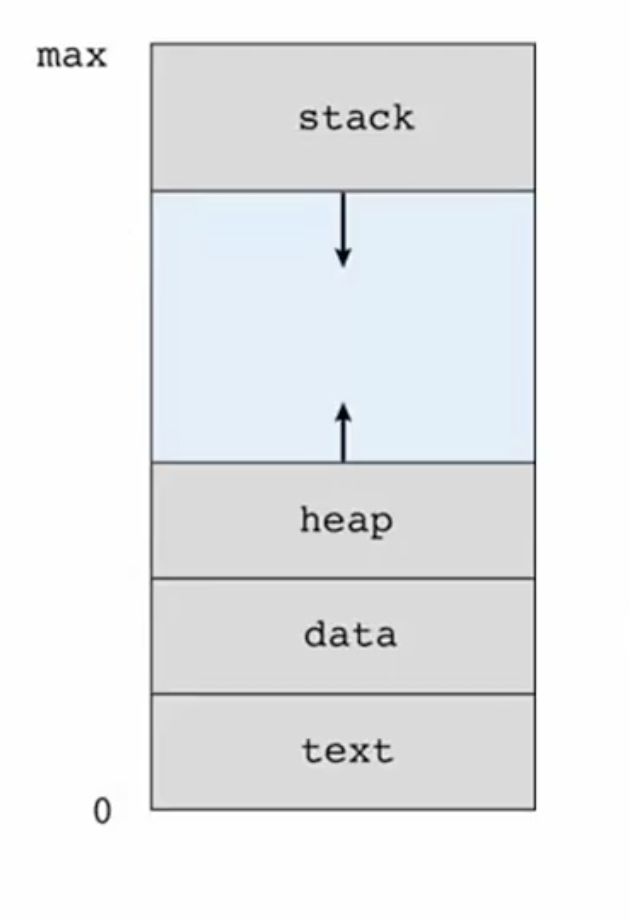

# 프로세스의 개념과 상태
운영체제가 수행해야 할 역할 중 프로그램의 실행이 **가장 중요한 역할**이다.  
현대의 운영체제는 한 번에 하나의 프로그램이 아닌 동시에 여러 가지 프로그램이 수행되는 것처럼 보이는 멀티태스킹이 필수다. 그리고 운영체제는 컴파일된 결과물인 프로그램과 실행되는 프로그램을 별도로 프로세스란 이름으로 구분 짓고 있다. 
 
프로그램을 관리한다는 것은 파일시스템안의 파일로써 프로그램을 잘 저장하면 되는 거지만, 프로세스를 관리하는 것은 보다 더 복잡한 기능이 필요하게 된다. 
특히 여러 개의 프로세스가 동시에 실행되게 하기 위해선 cpu와 같은 자원을 공평하고 효율적으로 할당할 방법이 필요하고, 또 여러 개의 프로세스 혹은 커널 사이에서 **충돌이 발생하지 않게 하는 관리기법**이 필요하다. 
 
이번에는 프로세스의 실행과 관리를 위한 운영체제의 동작원리, 설계 기법을 학습 할 것이다. 
먼저 프로세스의 개념에 대해 살펴보겠다. 

## 프로세스
> 컴파일 돼서 저장장치에 저장된 파일형태는 프로그램, 이것이 메모리에 적재되서 cpu를 통해 실행되는 상태를 프로세스라고 한다. 실행 중인 프로세스는 단순히 컴파일된 코드로만 이루어져 있지 않다. 아래와 같은 다양한 데이터들이 필요하다.
* 프로세스는 실행 중인 프로그램이다.
* 프로세스의 구성 요소
  * 프로그램 코드 : `text-section` 
  * 프로그램 카운터 : `progrom counter, PC`  // cpu 입장에서 필요한 정보
    * 다음에 실행할 명령(instruction)의 주소
  * CPU 레지스터 내용  // cpu 입장에서 필요한 정보
  * 프로세스 스택(stack) // 나머지 아래 3개는 프로세스가 실행될때 필요한 데이터
    * 함수의 구조로써 프로그램이 실행될때 각각의 함수 안에서 필요한 데이
    * 매개변수 `parameter`, 복귀 주소`return`, 지역 변수 `local variable`
  * 데이터 섹션 `data section`
    * 전역 변수 `global variable`
  * 힙 `heap`
    * 실행 중에 동적으로 할당되는 메모리
    * C에서의 `malloc` , `free`
    
## 메모리 상의 프로세스

위는 프로세스의 구성 요소 중 프로그램 코드, 데이터 섹션(stack, heap, data)가 어떻게 메모리에 저장되는지 나타내는 그림이다.  
프로그램은 전체 메모리 주소를 자신만 쓸 수 있는 가상메모리를 할당받아서 맨 아래쪽에 컴파일된 프로그램 코드(text)가 들어가고 그 위에 데이터, 힙, 스택이 들어간다. 
 
스택이란 것이 함수 호출을 위해 사용한다고 했는데,  컴퓨터 시스템에서는 자기가 사용하는 메모리 영역의 가장 위쪽부터 아래쪽으로 내려오는 식으로 스택을 유지한다. 힙은 할당된 시점부터 위로 올라가게 되어있다. 
그림에서 보면 알듯이 스택과 힙은 어떤 프로세스가 컴파일되고 실행된다고 할때 크기가 결정되지 않고 프로그램 실행조건에 따라 변할 수 있기 때문에 화살표모양으로 그려졌다. 

## 리눅스 프로세스의 메모리 구성

이 그림은 앞에서 봤던 간단한 그림을 실제 리눅스에서의 메모리상의 주소 값까지 상세하게 그린 것이다.  
`text segment`가 위의 코드고 초기화된 데이터(Data segment), 초기화 되지 않은 데이터(BSS segment)가 데이터에 해당한다.  
전역변수를 선언하더래도 처음에 값을 설정한 변수가 있고, 실제로 프로그램 코드가 실행되면서 값이 할당될 수가 있다. 
그 위에 힙영역, 스택이 있다. 
> 이 그림에서 스택위에 `kernel space`가 들어간다. 
운영체제는 `가상 메모리`라고, 실제로 pc의 램을 쪼개서 쓰는 게 아니라 메모리 관리를 통해서 각각의 프로세스에게 4gb라는 메모리를 다 할당한 것처럼 느끼게 만든다.
여기서 `kernel space`는 프로그램이 실행될 때 `system-call`로 커널서비스를 이용하게 되는데, 그때도 어딘가 메모리영역으로 프로그램 점프가 일어나야 한다. 그것을 같은 프로세스 내 메모리 공간에 포함하기 위해서 `kernel space` 공간을 마련해둔 것이다.

중간에 memory mapping region이 있는데. 여기는 파일을 메모리에 연결시켜 사용할 때 들어가는부분, 라이브러리 함수들이 존재하는 위치 등이 스택과 힙의 중간 부분이다. 

printf같은 라이브러리 함수는 중간 memory mapping region에 들어간다. 
> 이때 유의할 건 printf가 여기 들어가 있는 거처럼 메모리맵만 만들어지는 것이지 실제로 들어가 있는 건 아니다. 아래쪽도 사실 0부터 시작하는 건 아니고 32비트 경우 0x08048000, 64비트 경우 0x00400000 에서 시작한다. 
가장 밑부분도 커널이 사용하기 위한 특수한 영역으로 남겨둔다. 만약 그 메모리를 강제로 접근하려면 에러가 발생한다.

요약은.. 프로세스라는 것은 실행되는 프로그램인데, **컴파일된 코드 말고도 자기 자신을 실행하기 위한 변수들을 데이터 힙 스택으로 나눠서 쓰고 있다는 것!** 

## 프로세스 상태 (process state)
CPU는 절대로 여러개의 프로세스를 동시에 실행할 수 없다. 동시에 실행하려면 여러 개의 CPU가 필요하다. 
 
그런데 운영체제는 멀티 태스킹이라는 절묘한 기법을 통해 사람이 느끼기에 여러개의 프로세스가 하나의 cpu에서 동시에 실행되는 것처럼 느끼게한다. 
하나의 프로세스는 실행이 시작되면 종료될 때까지 쭉 cpu에서 실행되는것이 아니라 실행되다가 멈췄다 다시 실행했다가 하는 식으로 진행된다. 
그래서 일반적인 운영체제에서 프로세스관리를 말할 때 **프로세스는 상태를 가지고 있다**는게 중요한 개념이다. 
 

* 프로세스 상태 (process state)
  * 프로세스 실행 중에 상태 변경(transition)
  * 많은 프로세스가 하나의 cpu를 공유하기 위해 필요한 개념
* 프로세스 상태의 전형적인 종류
  * `New` : 프로세스가 생성되는 중이다.
  * `Running` : CPU에서 명령(instruction)이 실행되는 중이다.
    * 실제로 cpu에서 프로그램 코드가 실행되는 상태
  * `Waiting` : 프로세스가 어떤 사건(입출력 완료, 신호(signal), software interrupt)이 발생하기를 기다리는 중이다.
    * 만약 파일 읽기 위해 fread를 호출하면 이때 프로세스는 cpu를 실행하면서 read를 기다리는 게 아니라 waiting상태에서 입력이 들어오길 기다리게 된다.
    * cpu가 놀고 있다고 하더라도 (입력, 출력, 신호)가 도달하지 않는다면 cpu를 차지하지 못하는 상황이다.
  * `Ready` : 프로세스가 CPU에 할당되어 실행되기를 기다리는 중이다.
    * `Running`할 준비가 된 상태
    * cpu가 실행하지 않는 프로세스는 운영체제 시스템 안에 여러 개가 존재하게 된다. 그래서 이 waiting과 ready를 둠으로써 실행하지 않는 프로세스를 효율적이고 공평하게 관리하는 방법을 마련한다.
  * `Terminated` : 프로세스가 실행을 종료하였다.

## 프로세스 상태도 (state diagram)

1. 프로그램 처음 실행하면 new 상태에 들어간다. 아직은 cpu를 차지하지 못한다. 
2. cpu를 차지할 상황이 되면 운영체제로부터 admitted를 받아서 `running`하게 된다.
3. 하지만 실행을 준비할 것들이 많아서 바로 `running`으로 가지 못하고 `ready`상태를 거쳐야 한다.
  * 그러면 `ready`에서 언제 `running`으로 갈까
  * 바로 `scheduler`가 dispatch하면 된다.
    > 여기서 `schduler`란 것은 운영체제의 요소 중 아주 중요한 부분이고 여러 개의 프로그램이 동시에 실행되는 거처럼 규칙을 부여하는 것이 운영체제의 `scheduler`라고 한다. 상당히 중요하므로 `micro kernel`에도 포함되는 부분이다.  대부분의 프로세스들은 대부분 `ready`상태에 있는 것이고 단 하나만 `running`으로 가는것이다. 그것은 스케줄러의 정책에 따라 선택되는 것이다.
4. 한 프로세스 입장에선 ready에 있다가 running으로 가게되면 실제 cpu를 사용해서 자기가 하고자 하는걸 실행한다. 
5. 그런데 이게 계속해서 끝까지 실행되는 게 아니라 어떠한 조건을 만족하면 실행을 멈춘다. 
  * 그 조건은 총 3가지가 있다.
    1. 종료된다면 `exit`가 된다
    2. 실행하다가 scanf, read, printf 등 외부 장치에 대해 입출력을 요구했을 때 (I/O or event wait) 외부 장치가 동작하는 시간은 cpu가 동작하는 시간보다 수천 배에서 수십만 배 이상 느리다. 그동안 cpu가 아무거도 안 하고 대기하는 게 아니라 프로세스가 `waiting`으로 빠지게 되고 이 cpu는 다른 프로세스에게 할당한다.   이 `waiting`이 언제 끝날지는 프로그램은 알 수 없다. 바로 그것을 알려주는 것이 I/O or event completion 이다. 이것은 인터럽트에 해당한다. I/O completion interrupt 가 발생하면 `waiting`인 프로세스가 `ready` 로 넘어가게 된다.
    3. 계속 `running` 을 해야되고 I/O를 하지 않음에도 실행상태를 벗어나야 하는 상황이 발생한다. **이게 바로 운영체제 스케줄러가 여러 프로세스가 동시에 실행되는 거처럼 해주는 중요한 수단**이 된다.   운영체제는 한 프로세스가 긴 시간을 혼자사 용하도록 내버려 두는게 아니다. 일정한 시간이 지나면 (1ms, 수 ms 정도) 마다 인터럽트가 발생한다. `timer interrupt`가 실행되면 운영체제가 현재 실행 중인 프로세스를 중지를 시키고 `ready`상태로 빼놓게 된다. 그 빠진 프로세스 대신 기다리고 있는 다른 프로세스를 `running`으로 넣는다. 

## 프로세스 제어 블록 (process control block)
운영체제는 한 프로세스가 실행되면 여러 상태 사이를 계속 변경해가면서 프로세스 실행을 관리하게 된다.  
실행 중인 프로세스가 `ready` 로 갔다 `running`할때 중단된 시점으로 가려면 그 프로세스가 어디까지 실행했는지, 또 그 프로세스가 실행될 때 레지스터에는 어떤 값들이 들어있었는지, 몇 초 동안 사용했는지 등의 정보가 계속 유지되고 있다가 다음번 사용할 때 복원돼야 한다. 
그러기 위해서 프로세스의 제어를 위한 정보를 따로 모아서 별도의 커널 공간에 저장하고 관리한다. 
 
이건 마치 파일 입출력을 처리하기 위해 파일 속성정보를 파일 테이블이라는 곳에 별도로 유지하고 파일 디스크립터로 테이블만 엑세스하면 하드디스크에 있는 디렉토리나 파일 이름을 다시 검색할 필요 없이 엑세스 할 수 있었던 것 처럼.
바로 그와 비슷하게 프로세스를 관리하기 위한 여러가지 속성정보를 커널의 별도 공간에 보관하는데 그게 바로 프로세스 제어 블락`Process Control Block, PCB`이라고 한다.   
 
하나의 프로세스마다 아래 그림과 같은 자료구조가 하나 만들어지는 것이고, 운영체제가 관리한다. 
프로세스들이 계속 실행되지 않고 상태가 변하더라도 다시 실행할 때 마치 그 프로세스 입장에선 중단된 게 아니고 계속 실행되고있는 것처럼 연속적으로 실행할 수 있게 된다. 
 

* 프로세스 제어 블록 (Process Control Block, PCB)
  * 프로세스의 실행을 제어하는 데 사용하기 위한 자료구조
  * 운영체제의 메모리 공간에 저장
* 프로세스 제어를 위한 정보
  * 프로세스 상태 (process state)
  * 프로그램 카운터 (PC)
  * CPU 레지스터
  * CPU 스케줄링 정보
  * 메모리 관리 정보
  * 회계 (accounting) 정보
  * 입출력 상태 (I/O status) 정보
  
### Linux의 PCB

리눅스의 커널 소스를 보면 /include/linux/sched.h 라는 헤더파일에 `task_struct`라는 구조체에 정의되어있다.
바로 이것이 `PCB 정보`이다. 
실제로 커널이 동작하면 각각의 `PCB`는 `linked list`형태로 구성된다.

## 문맥 교환 (context switch)
 
* 프로세스의 문맥 (context)
  * 프로세스 제어를 위한 다양한 정보 (PCB에 저장되는 정보)
    * 프로세스 상태, 프로그램 카운터, 레지스터 값 등
* 문맥 교환 (context switch)
  * 스케줄러가 CPU를 다른 프로세스에게 할당하려고 할 때 현재 프로세스의 문맥을 PCB에 저장하고 새로운 프로세스의 PCB로 교체하는 것
* 문맥 교환 비용 (overhead)
  * PCB에 저장과 복구 시간 동안 프로세스의 유효한 작업은 중지
  * 운영체제 및 프로세스의 성능에 중요한 영향을 준다.