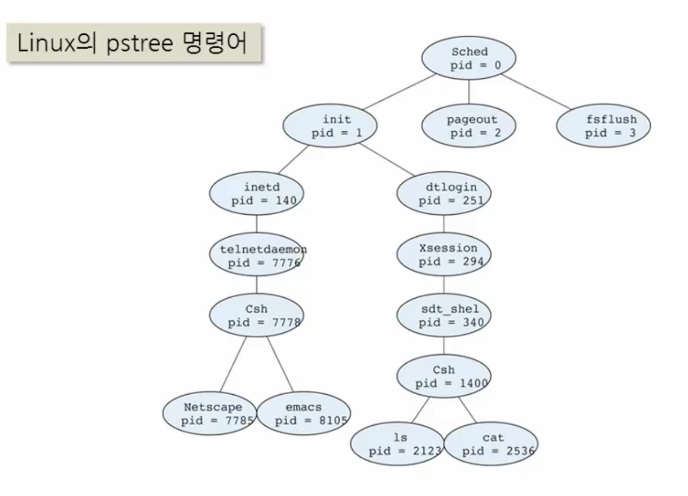
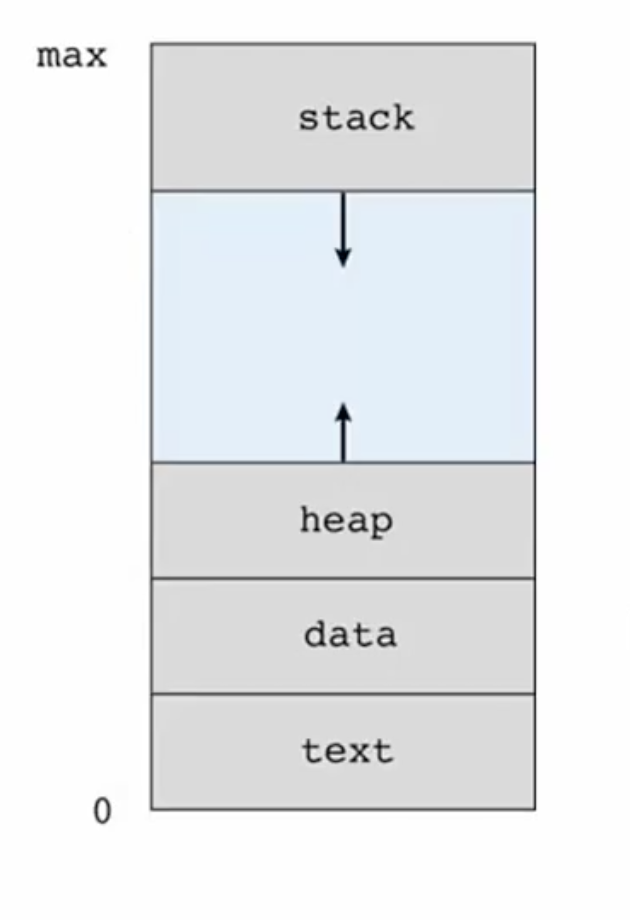
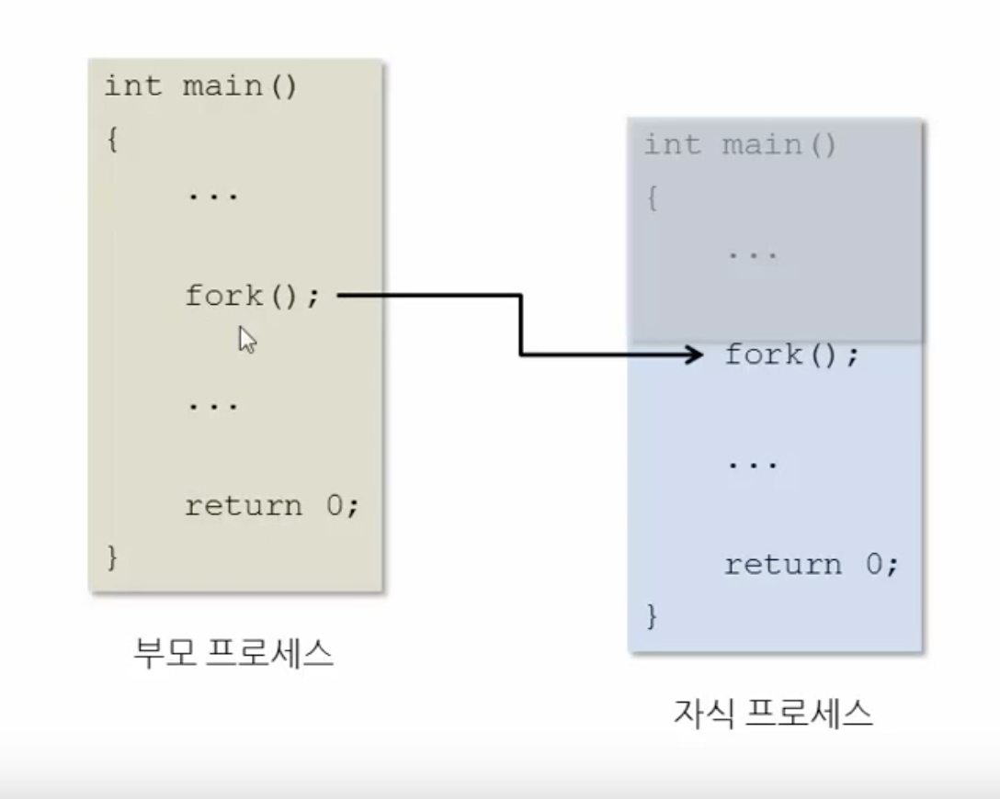

# 프로세스 제어와 API
프로세스 관리는 크게 2가지 요소로 구성되어있다. 
1. 프로그램을 실행해서 프로세스를 생성하는 것과 종료하는 것
2. 실행 중인 프로세스의 상태를 변경하면서 멀티태스킹이 가능하게 하는 기능
 
그중에서 2.는 **운영체제 스케줄러**라는 기능을 통해서 운영체제가 주도적으로 수행하는 것이고, 1.은 운영체제가 주도적으로 한다기보단, 사용자의 필요성 혹은 어떤 프로그램의 필요성에 의해서 새로운 프로세스가 실행되거나 종료되는 것 
 
첫 번째에 있는 프로세스의 생성과 프로그램의 실행 종료라는 것은 프로세스의 제어라는 개념으로 운영체제는 그것을 달성하기 위한 내부 서비스를 제공할 뿐이고, 실제 서비스는 프로그래머가 요청해서 사용하는 것이다. 
파일 시스템에서 여러 가지 서비스, API 처럼 운영체제는 프로세스를 제어하는 API를 제공함으로써 프로그램 혹은 사용자가 필요한 프로세스를 실행하거나 종료하도록 한다. 
 
그렇다면 이번 장에선 프로세스 제어라는 것이 어떤 방식으로 이루어지는지 알아보도록 하겠다. 

## 프로세스 생성 (creation)
> 프로세스를 생성하기 위한 복잡한 절차는 커널 안에 구현되어있다. 사용자는 그런 복잡한 커널의 구조까지 알 필욘 없고, 운영체제에서 제공해주는 시스템 콜을 사용하면 된다.

프로세스를 생성한다는 것은 현재 실행 중인 어떠한 프로세스에서 프로세스 생성을 위한 시스템 호출을 요청하면서 이루어진다. 
이때 여러 프로세스를 효율적으로 관리하기 위해 생성을 요청한 프로세스와 생성된 프로세스는 부모와 자식이라는 관계를 맺는다. 
그래서 프로세스 생성이 계속 되면 그것들은 인간 세상의 족보와 같이 프로세스 트리를 구성하게 된다. 

일단 시스템이 부팅되고 나면 그 이후에 실행되는 모든 프로그램들은 누군가가 자신을 실행되기 위한 프로세스를 수행해야 실행된다. 
모든 시스템 내 프로세스가 하나의 트리 내에서 연결돼있으므로, 각각 프로세스의 제어정보를 효율적으로 관리할 수 있게 된다. 
그리고 한 시스템에서 프로세스가 만들어지면 프로세스 ID를 가지게 된다.  
프로세스 id와 어떤 프로그램이 실행되고있는지 이름을 가지게된다. 똑같은 프로그램이라도 여러 개 실행될 수 있는데 그러면 같은 이름이지만 다른 process id를 가지게 된다. 
 
새로운 프로세스가 실행된다는 것은 이 프로세스에서 어떤 프로그램이 실행되고 있는 것이다. 그렇기 문에 새로운 프로세스는 그 프로그램이 실행되기 위한 앞에서 봤던 프로세스의 고유한 메모리 구조가 필요하게 된다.  
이런 것을 자원이라 말하고 있고, 새로운 프로세스를 생성한다는 것은 그런 자원까지 시스템에서 확보해줘야 한다. 
 
이런 자원을 할당하는 것은 여러 방법이 있는데. 가장 큰 부분이 운영체제가 이 시스템 호출을 수행하면서 직접 할당하는 것이다. 
그 프로세스를 위한 PCB, 주소 공간 등을 할당해준다. 
또 몇몇 프로세스는 부모 프로세스가 사용하고 있던 메모리 영역을 공유하는 방법을 취하기도 하고, 
부모 프로세스가 파라미터로 전달할 수도 있다.  
 
* 프로세스는 시스템 호출을 통해 새로운 프로세스를 생성
  * 부모 프로세스와 자식 프로세스
  * 여러 세대의 프로세스 생성 -> 프로세스 트리 형성
* 프로세스 식별자 (Process ID)
  * 생성된 프로세스는 각각의 고유한 식별 번호를 가진다
    * ps 명령으로 프로세스 목록을 조회한다 (unix, linus)
* 새 프로세스(자식)가 사용할 자원
  * 운영체제로부터 직접 획득/할당 (새로운 PCB와 주소 공간)
  * 부모 프로세스 자원의 일부분을 전달 혹은 공유
  * 부모로부터 매개변수로 전달 (새 프로그램 실행 시)
 
## 자식 프로세스의 실행 방식
자식 프로세스가 실행되는 상황에 따라 서로 다른 실행 방식을 가지게 된다. 
그 방식을 바라보는 관점도 두 가지가 있다. 
순서를 어떻게 할 것인가. 
메모리 공간을 어떻게 활용할 것인가. 

먼저 실행의 순서를 살펴보면, 부모 프로세스와 자식 프로세스가 동시에 실행될 수도 있지만, 또 부모 프로세스가 멈춰있고 자식이 끝나길 기다리는 순서로 실행될 수 있다. 

할당된 자식 프로세스 메모리 공간을 어떻게 활용하느냐에 따라 2가지로 나뉜다. 
이걸 이해하려면 프로세스의 실행이라는 것과 프로그램의 실행이라는 것을 명확히 구분할 수 있어야 한다. 
 
이러한 관점이 나온 이유는 뭐냐면 우리가 프로세스를 생성하게 되면 프로세스의 고유한 메모리 구조가 생성된다. 

* 프로세스의 구조

그리고 이 메모리 구조 안에는 반드시 어떠한 프로그램이 들어가 있다.(프로그램 코드(text)와 데이터(data))  
우리는 무엇을 구분해야 하냐면 프로세스라는 것은 이 프로그램을 담기 위한 틀이라고 이해해야 한다. 
 
즉, 프로세스를 생성한다는 것은 프로그램을 담기 위한 틀을 위한 메모리 공간이 확보되는 것이 이 틀 안에다가 무엇을 집어넣느냐에 따라 두 가지가 달라진다 
첫 번째는 부모 프로세스와 동일한 내용이 복사된다는 것이다.  
두 번째는 자식 프로세스의 메모리 영역에 새로운 프로그램을 적재하는 것이다. (일반적인 프로세스 생성) 
 
그러나 원래 운영체제가 제공하는 프로세스라는 개념은 프로그램에 코드와 데이터를 담기 위한 제어의 틀일 뿐이지 이 프로세스와 프로그램은 항상 고정적으로 연결되어있지 않다는 것이다.  
그래서 이 공간상에 얼마든지 다른 프로그램을 넣을 수가 있다.  
exec()을 실행하면 기존에 있던 프로그램코드는 내용이 없어지고 새로운 프로그램의 코드와 데이터가 메모리 영역에 들어간다. 
 
* 실행 제어에 따른 두 가지 실행 방식
  * 부모 프로세스와 자식 프로세스가 동시에 실행 (concurrency)
  * 부모 프로세스가 자식 프로세스의 종료를 기다림
    * UNIX에서 wait() 시스템 호출 사용
* 주소 공간(메모리 영역)의 활용에 따른 두 가지 실행 방식
  * 자식 프로세스의 주소 공간의 내용은 부모 프로세스의 복사본
    * 주소 공간 자체는 새로운 메모리 영역에 할당
  * 자식 프로세스의 주소 공간에 새로운 프로그램을 적재
    * UNIX에서 exec() 시스템 호출 사용
    * 새로운 프로그램의 코드와 데이터를 적재 (기존 내용 파괴)
    
## 프로세스 생성 시스템 호출
프로세스 제어에 가장 핵심 되는 기능 
리눅스에선 fork wait exec 시스템콜을 제공한다 
 
* fork()
  * fork를 호출하면, 커널이 자식 프로세스를 위한 메모리 공간을 할당하고 프로세스 id를 리턴해준다.
  * 부모로 어떤 자식 프로세스가 생겼는지 알 수 있고, 필요시 제어할 수 있다.
  * 어떤 하나 프로세스가 있으면 안에는 반드시 프로그램이 들어있어야 한다.
  * 비어있는 프로세스가 생성될 수 없다.
  * 새로운 프로그램을 지정하지 않은 상태에서는 프로세스를 생성하면 자식 프로세스 안에는 부모와 동일한 내용의 텍스트코드와 데이터를 담게 된다.
  * 이렇게 생성된 자식 프로세스는 부모가 명시적으로 wait하지 않은 이상 동시에 실행되는 프로세스가 생성된다.
  * 
    * fork 하면 자식 프로세스가 생성되는데 부모가 fork 한 이후부터의 부모와 똑같은 코드를 실행한다.
    * 왜 이렇게 되는가? 부모가 복제해서 자식으로 들어갈 때 PCB도 같이 복제가 되는데, PCB 정보 중 중요한 내용인 현재 어디까지 실행하고 있냐는 프로그램 카운터 정보이다. 
    * fork가 호출되었을 이 시점에서 복사된 부모 프로세스의 PCB영역은 자식 프로세스도 fork 전까지 실행하진 않았지만 실행한 것처럼 생성된다.
      1. 부모 프로세스에서 fork를 호출하게 되면 똑같은 내용이 자식 프로세스에게 복사된다.
      2. 부모 프로세스의 fork()는 리턴을한다.
      3. 자식 프로세스도 이제 실행되는데 fork()가 리턴하기 직전부터 실행한다.
      4. fork 함수는 동적으로 보면 두 개가 됐지만, 정적으로 보면 하나의 코드였다. 하나의 코드가 fork를 실행하는 순간 두 개가 되고 호출은 한번 되었지만 리턴은 2번 되는 형태를 가진다.
    * fork라는 시스템호출은 두 번 리턴하는 함수다 라고 통상적으로 얘기한다.
    * 이때 부모 프로세스의 리턴값과 자식의 리턴값은 다르다.
    * 부모는 새로 생성된 프로세스 id를 리턴한다.
    * 자식은 0을 리턴한다.
    * fork 이후에는 반드시 리턴값을 체크해서 값이 0인지 id값인지 확인해야 한다.
  * 새로운 프로세스(자식)을 생성하고 프로세스 ID를 반환
  * 새로운 프로세스는 부모와 동일한 내용의 주소 공간 사용
  * 부모와 자식 프로세스에서 반환되는 PID가 다름
    * 부모와 자식을 구별하는 수단
* wait()
  * 부모 프로세스에서 호출하는 함수
  * 자식이 없는 상태에서 wait를 호출하면 아무것도 안 하고 리턴함
  * 자식이 있을 때, 자식이 존재할 때까지 wait 상태에서 멈추는 호출
  * 스케줄링 상태에서 자식은 ready <-> running을 왔다 갔다 하지만 부모는 waiting에서 기다렸다가 자식이 끝날 때 발생하는 waiting signal interrupt를 받아서 나중에 복귀한다.
  * 자식 프로세스가 종료하기를 기다림 (자식 프로세스 ID반환)
  * 자신은 ready queue에서 제외
    * wait signal interrupt에 의해 나중에 다시 실행에 복귀
* exec()
  * fork와 별개의 개념이다.(fork가 없더라도 실행할 수 있는 함수다)
  * 본연의 의미는 자식 프로세스에서 어떤 프로그램을 실행시킨다는 의미가 아니라 현재 실행되고 있는 프로세스에서 그 프로세스의 주소 공간을 새로운 프로그램으로 교체한다는 의미를 가지게 된다.
  * exec 이 동작하면 이 프로그램의 프로세스영역에 내가 exec으로 지정한 하드에 있는 다른 프로그램의 내용이 들어오게 된다.
  * 원래의 프로그램은 사라지고 새로운 프로그램이 들어오는것이다.
  * 프로세스의 주소 공간을 새로운 프로그램의 내용으로 교체
  * exec() 호출의 반환 값은 의미가 없다.
  
## 프로세스 종료 (termination)
프로세스의 종료는 두 가지 방식이 있다. 자기 스스로 자신을 종료하는 것, 
다른 프로세스에 의해서 종료되는 것 
 
* 프로세스 자신의 실행을 종료 (exit() 시스템 호출)
  * 어떤 위치에서도 사용하면 종료된다. 커널에게 현재 프로세스를 종료시키고 메모리 자원을 반납하는 기능을 수행
  * 부모 프로세스에게 상태 값 반환
  * 메모리, 열린 파일, 입출력 버퍼 등의 자원을 운영체제에 반납
* 자식 프로세스를 강제로 종료
  * 쉘에서 프로그램을 실행하다 컨트롤 C 키를 누르면 실행 중인 프로그램이 강제적으로 종료되는 것을 볼 수 있는데, 그 프로그램의 의도에 의해 종료하는 게 아니라, 사용자가 컨트롤 C를 입력한 쉘이라는 프로그램에 의해 종료된다.
  * TerminateProcess() - Win32, kill() - UNIX
  * 자식 프로세스가 할당된 자원을 초과하여 사용할 때
  * 자식 프로세스에게 주어진 작업이 필요하지 않을 때
  * 부모 프로세스가 종료된 후 자식 프로세스의 실행이 허용되지 않은 시스템인 경우