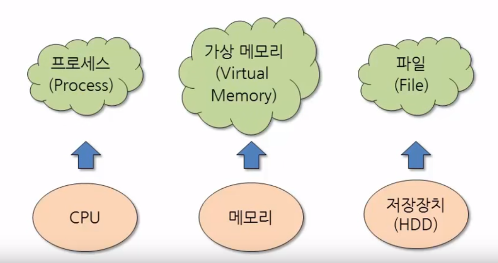

## 운영체제의 정의와 역할

운영체제는 컴퓨터 하드웨어 자원을 추상화를 통해 사용자가 프로그램을 원활히 이용할수 있게 도와주는 중재자 역할 및 자원의 할당자, 제어프로그램 역할을 한다.

* 운영체제란 하드웨어와 사용자 사이의 중재 역할을 수행하는 프로그램  
  * 프로그램을 실행하고 문제를 쉽게 해결함
  * 자원을 편리하고 효율적으로 사용하게 도와줌
* 컴퓨터 시스템을 **추상화**하여 제공함

* 운영체제는 자원 할당자
  * 자원(하드웨어)를 관리해서 효율적이고 공정하게 사용 요청을 처리
* 운영체제는 제어 프로그램
  * 에러를 방지하면서 프로그램을 실행
* 운영체제는 컴퓨터에서 항상 실행되는 하나의 프로그램(**커널**)이다.
  * 시스템 프로그램, 응용 프로그램
  
## 운영체제의 핵심 기능
#### **공부하게 될 운영체제의 여러가지 구성과 내용들은 다중 프로그래밍과 멀티태스킹을 아무 문제없이 잘 이뤄지게 하기 위한 것**
* 다중 프로그래밍(Multi Programming)
    * CPU와 자원 이용률 향상
    * CPU가 항상 동작하도록 작업 배치
    * 모든 작업들 중 일부가 메모리에 적재되고 작업 스케줄링에 의해 실행될 작업을 선택
* 시분할-멀티태스킹
    * 사용자가 느끼기에 여러 프로그램들이 한꺼번에 실행되는 것(멀티태스킹)
    * 이때 중요한건 응답시간이 중요함
        * 응답시간을 줄이기 위해 시분할(time-sharing) 개념으로 CPU시간을 잘게 쪼개서 매우 빈번하게 교체하여 실행하는 방법

## 운영체제의 역할
* 프로세스 관리
    * CPU와 연관되어있고, 프로그램을 실행시키는것과 관련
    * 프로세스란 실행중인 프로그램
    * 프로세스를 작동시키기 위해선?
        * 어떤 자원을 할당 할 것인가
    * 프로세스를 병행 실행시키기 위해선?
        * 어떤 멀티플렉싱을 할 것인가
* 메모리 관리
    * 어떤 프로세스와 데이터를 메모리에 적재 할 것인지 결정
    * CPU사용률과 사용자에 대한 응답시간을 최적화
    * **프로세스에게 가상메모리 공간 제공**
* 저장장치 관리
    * 저장장치의 물리적 특성을 추상화하여 논리적인 저장단위로 제공 -> **파일**
    * 파일 시스템
        * 파일: 파일 생성자에 의해 정의된 정보의 집합체
        * 디렉토리 : 파일 관리를 용이하게 하기 위한 정보
    * 대용량 저장장치
        * OS는 파일들이 어떠한 저장장치에 저장될것이냐를 결정함
        * 보조 저장장치
            * 다량의 프로그램과 데이터를 장기간 보관하기 위한 장치
            * 주로 디스크장치가 사용된다(SSD, HDD)
            * CPU 및 메모리의 성능 차이가 매우 크기 때문에 컴퓨터 시스템 전체 성능에 중요한 부분을 차지함.
        * 운영체제의 대용량 저장장치 관리 기능
            * 자유공간(free-space) 관리
            * 저장 공간 할당(allocation)
            * 디스크 스케줄링
    * 저장장치의 계층과 캐싱(caching)
        * 캐싱(caching)
            * 컴퓨터 시스템에서 저장에 대한 이상적인 요구사항은 아주 큰 데이터를 아주 빠르게 저장하거나 읽어오는것이다. 하지만 현재 기술로는 용량이 크면 클수록 느려진다.
            * 이런점을 보완하기위해 가상적으로 계층구조로 묶어서 아주 빠른 저장장치에서 많은 데이터를 이용하도록 하는것이 바로 캐싱의 개념이다.
                * ex. cpu에 있는 캐시메모리, 인터넷의 버퍼링
            * 낮은 단계 저장장치에 저장된 많은 정보를 높은 단계 저장장치가 제공하는 빠른 속도로 접근
            * 낮은 단계 저장장치에서 자주 접근되는 일부의 정보를 높은 저장장치에 저장

* 입출력 시스템
* 보호와 보안
    * 보호 : 운영체제가 정의한 자원에 대해 프로세스나 사용자의 접근을 제한함
    * 보안 : 내부, 외부의 공격으로부터 시스템을 보호하는 기능
    * 사용자 식별
* 네트워킹